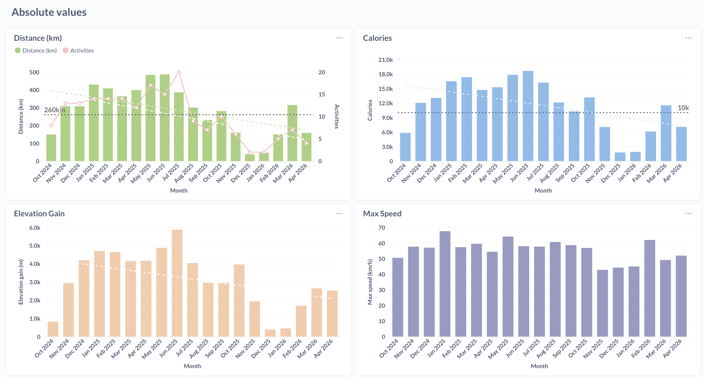

# What's this about
A project to learn Python+Django by creating a small web app to track my Strava Ride activities.

# Why
On one hand, I am learning Python+Django.

On the other hand, I want to keep track of my personal Strava Ride activities and be able to visualize data in ways which are not always present in Strava nor Garmin Connect.

So, why not?
It's a good excuse to learn something new and useful, while being able to view my Ride data in the way I want.

# What does it do?
- Loads one Strava athlete and syncs all Ride activities
- Real-time sync via Strava webhook (`create` / `update` / `delete`)
- Auto-renames generic activity names (e.g. "Morning Ride" → "Cornellà - [Molins] - Turó d'en Pisca - Cornellà ~8km spacing") using Overpass (peaks/saddles) + Nominatim (municipalities) reverse-geocoding
- Public dashboard with paginated activity list and embedded Grafana charts
- Detects missing activities and provides one-click sync to backfill them
- Django admin with custom bulk actions: re-trigger auto-rename, force auto-rename
- Optional Metabase/Grafana containers via `docker-compose.yml` for ad-hoc visualisations
- Test suite with 90+ pytest tests (mocking external HTTP)

# How does it look like?

> Note: screenshot is from an earlier version of the dashboard — TODO refresh.

# Known issues and limitations
- Only one user supported.
- Render free tier sleeps after 15 min idle → the first webhook after sleep may miss; Strava retries automatically over the following hours.
- Geocoding (Nominatim) can be non-deterministic on administrative boundary coordinates — a point on a municipal border may resolve to one side or the other at different times. Rare; the force auto-rename admin action can be used to re-roll if needed.

# Next steps
- Improve visualisations of the data (e.g., total distance per month, average speed, calories per month).

# How to use this project
## On Strava
- Enable the Strava API. As of this writing, go to https://www.strava.com/settings/api and create an app.

## Locally
- Make sure you have Python and uv installed (https://github.com/astral-sh/uv))
  - And docker for Metabase
- Clone this repo
- `cd` into the project folder and run the following commands:
  - `uv venv --seed`
  - `source .venv/bin/activate`
  - `uv sync`
- Initialize the environment variables. Create a `.env` file in the project root with the following variables:
  - `STRAVA_ACCESS_TOKEN=your_strava_access_token`
  - `STRAVA_CLIENT_ID=your_strava_client_id`
  - `STRAVA_CLIENT_SECRET=your_strava_client_secret`
  - `STRAVA_REFRESH_TOKEN=your_strava_refresh_token`
  - `DB_NAME`=stravagancia 
  - `DB_USER`=strava 
  - `DB_PASSWORD`=strava 
  - `DB_HOST`=localhost 
  - `DB_PORT`=5432
- Initialize the database and load data:
  - `docker compose up -d postgres`
  - `python manage.py migrate`
  - `python manage.py createsuperuser`
  - `python test_strava_connection.py` (to verify Strava API access)
  - `python manage.py load_athlete`
  - `python manage.py detect_missing_activities`
  - `python manage.py load_missing_activities`: may take a while depending on how many activities you have
- Run tests: `pytest` (uses `pytest-django`)
- To exercise the webhook end-to-end with a real Strava upload (requires `activity:write` scope on the refresh token):
  - `python manage.py upload_test_gpx path/to/ride.gpx`
- Optionally: Run metabase using docker-compose:
  - `docker-compose up` (Will launch Metabase on port 3000)
- Optionally: run the Django development server:
  - `python manage.py runserver`
  - Access the admin interface at http://localhost:8000/admin using the superuser credentials created before.
  - Some basic URLs are already wired up in strava_integration/urls.py for exploration.

Auth in metabase:
- email: admin@admin.com  
- password: django-strava-01

## In production (Render + Neon)

This project runs on Render's free tier (Docker service) with a Neon Postgres database. (The live app URL is intentionally kept out of this public repo to avoid drive-by pings that would keep the free-tier service awake.)

- The service container builds from `Dockerfile` and runs `entrypoint.sh` (migrate, create superuser, collectstatic, gunicorn).
- Auto-deploys on `git push origin main`.
- Env vars set on Render:
  - `STRAVA_REFRESH_TOKEN` (only the refresh token — access tokens are minted on each call by `utils.refresh_access_token`)
  - `STRAVA_CLIENT_ID`, `STRAVA_CLIENT_SECRET`
  - `STRAVA_WEBHOOK_VERIFY_TOKEN`
  - `DATABASE_URL` (Neon connection string)
  - `SECRET_KEY`, `ALLOWED_HOSTS`
  - Optional: `DJANGO_SUPERUSER_USERNAME`, `DJANGO_SUPERUSER_PASSWORD`, `DJANGO_SUPERUSER_EMAIL` (used once by `entrypoint.sh` to create the admin user on first boot).

### Keep-alive (avoiding Render's 15-min sleep)

Render's free tier puts the service to sleep after 15 min of inactivity, which adds a ~30s cold start on the first request and can cause Strava webhooks to miss the 2s timeout (Strava retries, so events still arrive eventually).

A **Cloudflare Worker** (free) pings `GET /healthz/` every 12 min on a Cron Trigger, but only during **09:00–23:59 Europe/Madrid** (enforced in the Worker code, DST-aware), so the service still sleeps overnight. Cloudflare cron fires regardless of the previous result (no backoff), and the Worker uses a `curl` User-Agent + retries to ride through the cold-start `503` — fixing the failure mode that made the old cron-job.org / GitHub Actions pingers unreliable. Code and details in [`keepalive/`](./keepalive/).

- **Endpoint**: `GET /healthz/` → returns `ok` (200), no DB, no auth. Defined in `strava_integration/views_ui.py` (`healthz`); it logs each hit with the client IP + User-Agent so keep-alive traffic shows up in Render logs.

Why the 750h/month cap matters: Render free tier allows 750h of running time per account per billing cycle. One service awake 24/7 = 720h. Sleeping overnight frees hours for a second service (the Grafana below).

### Dashboards (Grafana on Render)

The `/charts/` page embeds Grafana dashboards. In production, Grafana runs as a **separate Render service** built from [`grafana/Dockerfile`](./grafana/Dockerfile) — provisioned to read the Neon DB, with anonymous read-only access enabled for embedding. The Django `GRAFANA_URL` env var points `/charts/` at it. Locally, `docker-compose.yml` runs Grafana instead.

### Admin login protection

The Django admin login is rate-limited with [django-axes](https://github.com/jazzband/django-axes): 5 failed attempts lock the `(IP, username)` pair for 1 hour, X-Forwarded-For-aware for Render's proxy. Config in `strava_app/settings.py`.

The admin uses the [django-unfold](https://unfoldadmin.com/) theme (configured in `strava_app/settings.py` under `UNFOLD`; the custom `ModelAdmin`s in `strava_integration/admin.py` extend Unfold's).
